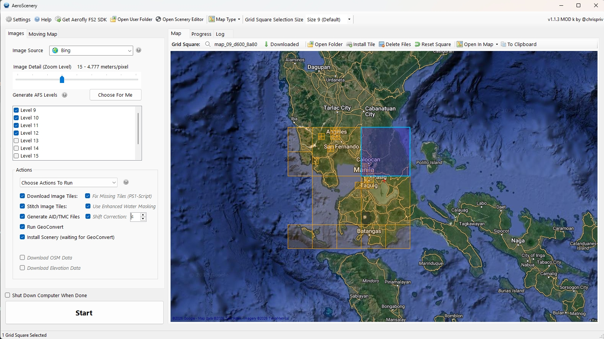

# Get Started – First Photo Scenery

Create a small test scenery for **Aerofly FS4** with **Community Mod k**.

Install first: [Installation Guide](installation.md) (portable ZIP by default).
Complete Settings tabs **AeroScenery** and **GeoConvert** before you continue.

The main window in **easy** mode (**Run Default Actions**) after a first start:

**Choose Actions To Run** shows the extra steps (expert / pro mode):

---

## Grid size and zoom (read this first)

Users often pick tiles that are too small, or Size 9 at much too high zoom **20**
(~0.149 m/pixel). That is far too heavy for a first try.

| Use | Grid Square Size (toolbar) | Image Detail (zoom) | Approx. resolution |
|---|---|---|---|
| First test | Size **11** | 15 or 16 | ~4.8 m or ~2.4 m |
| Normal base scenery | Size **9** or **10** (default 9) | 15 or 16 | ~4.8 m or ~2.4 m |
| Airports, towns (smaller area) | Smaller than the base, or a subset | 17 | ~1.2 m |
| Airport grounds, FS4 **PC** only | Small area | 18 | ~0.6 m |

Zoom **18** is not useful for the **mobile** (FSG Android) path.

On the main window: set **Grid Square Selection Size** in the toolbar first,
then **Image Source**. The `(?)` next to Image Source explains the same order.

Do not start **nine Size 9** squares on a first run. One test square is enough.

---

## Step 1 – Location and size

- Pan the map, pick land
- Toolbar: Size 11 for a test, later Size 9 or 10
- Click the map to select the square(s), one may be enough for a first try

---

## Step 2 – Image source and zoom

- Choose an image source (Google and similar sources have their own limits)
- Set **Image Detail (Zoom Level)** — 15 or 16 for the first scenery
- **Generate AFS Levels** → **Choose For Me** (see the `(?)` there)

---

## Step 3 – Actions

- **Run Default Actions** runs the usual chain
- Or **Choose Actions To Run** for single steps (for example **Run GeoConvert**
  again after you edited stitched images)

Set **AFS Working Scenery Folder** in Settings first. Enable **Install Scenery (waiting for GeoConvert)** so every
selected square is installed for FS4 PC when GeoConvert finishes. 

**Install Tile** on the map toolbar installs **only** the square that is
selected. Prefer these functions over copying files by hand.

---

## Step 4 – Run and wait

Click **Start**. Downloads can take time. GeoConvert is heavier than the
image download, takes much longer and is CPU and memory intensive. 
You can continue to work in AeroScenery while GeoConvert runs on powerful hardware.

On a normal PC, turn on sequential GeoConvert in Settings if you process
more than one square. With **Install Scenery (waiting for GeoConvert)**,
AeroScenery waits about **60 seconds** of idle GeoConvert (stable memory and
lower CPU) before it closes the GeoConvert window, unless you close it
yourself. If the automatic “finished” detection fails, close the GeoConvert
console manually. Details: [Installation](installation.md) and [FAQ](faq.md).

---

## Step 5 – Check in Aerofly

- Start Aerofly FS4
- Confirm the scenery name/folder you set in Settings
- If nothing shows: you probably copied files manually — use **Install Tile**
  or **Install Scenery** and check the AFS user folder path

---

## Step 6 – Optional: convert for FSG Android (mobile)

Always build the scenery **for Aerofly FS4 on the PC first** (the steps above).
Mobile is an **extra** conversion of that desktop result, not a separate
workflow.

### If you have no Aerofly FS4 on this PC

You can still run the full AeroScenery chain. Create an empty **dummy AFS user
folder** anywhere on disk (for example `D:\AFS4UserDummy\`) and enter it under
Settings → **AeroScenery** as the AFS user folder. Set **AFS Working Scenery
Folder** as usual, then use **Install Tile** or **Install Scenery** so the
desktop `.ttc` files land in that dummy folder. You do not need a licensed
Aerofly install for that.

### Extra conversion for Android

1. Install **Aerofly FS 2 Content Converter** from the FS2 SDK tools on the PC
   (same SDK family as GeoConvert; it is a **separate** app and must already
   be installed).
2. In Settings → **GeoConvert**, enable **Conversion for mobile**. Then the
   step **Generate AID / TMC Files** also creates:
   - a folder named `##-geoconvert-ttc-mobile` (`##` is the zoom level), and
   - `content_converter_config_mobile.tmc`
3. After GeoConvert has finished, right-click that **TMC** file and choose
   **Run with Aerofly FS 2 Content Converter**. That writes FSG (Android)
   compatible `.ttc` files.
4. In the scenery **install** folder (the dummy folder is fine if you do not
   use FS4) — **better: a copy of that folder** — replace the desktop `.ttc`
   files with these mobile `.ttc` files.
5. Pack the scenery for FSG as a **`.tme`** file. The folder layout is close
   to FS4; only the front part (the `scenery` insert) differs:

   `dlc_<scenery-name>\scenery\images\map_09_...`

   Zip that folder, then rename `.zip` to `.tme`. This rename trick is **only
   for image scenery**, not for other FSG add-ons.

Use a sensible zoom for mobile (15–17). Zoom **18** is for FS4 PC hotspots
only.

The `(?)` next to **Conversion for mobile** in Settings covers the TMC step.
To run the extra conversion **later** on existing tiles, see the [FAQ](faq.md).

---

## Moving map (Aerofly FS4 only)

The moving map tracks the aircraft on the AeroScenery map. It works **only with
Aerofly FS4 on PC**:

- **FSG Android** has no *Broadcast flight info to IP address* setting.
- **Shared memory** works only on the **same PC** that is running FS4.

Open the **Moving Map** side tab. Use **UDP** or **DLL (Shared Memory)** under
the HUD. Map fixed, flight tracing and hide working tiles are optional.

### UDP

1. In Aerofly FS4: **Settings → Miscellaneous → Broadcast flight info to IP
   address = on**.
2. Set the broadcast IP to your subnet broadcast (last octet **255**), for
   example `192.168.1.255`.
3. Set **Broadcast IP port** to **49002**.
4. Click the moving-map `(?)` in AeroScenery to see the IPv4 address it
   detected. Allow AeroScenery through the firewall / antivirus if the map
   does not move.
5. Start a flight in FS4, then start the moving map in AeroScenery.

### Shared memory (DLL bridge)

This mode uses **AeroflyBridge** by [Juan Luis Gabriel (jlgabriel)](https://github.com/jlgabriel/Aerofly-FS4-Bridge)
(MIT). Follow that project’s **Quick install**:

1. Copy `AeroflyBridge.dll` into  
   `%USERPROFILE%\Documents\Aerofly FS 4\external_dll\`  
   Mod k includes a copy under `Resources\external_dll\`. You can also take
   the DLL from the [Aerofly-FS4-Bridge releases](https://github.com/jlgabriel/Aerofly-FS4-Bridge/releases).
2. Start Aerofly FS4 and load a flight.
3. In AeroScenery, select **DLL (Shared Memory)** on the Moving Map tab.

Credits: Aerofly FS4 Bridge — https://github.com/jlgabriel/Aerofly-FS4-Bridge

---

## Next

- Raise zoom only on airports and cities (17, or up to 18 on FS4 PC)
- Optional: OSM / elevation downloads, water masking (Settings + Actions)
- Optional: FSG Android conversion and `.tme` pack (Step 6)
- Moving map: UDP or shared-memory DLL (FS4 PC only)
- [Feature Overview](featureoverview.md)
- [FAQ](faq.md)
