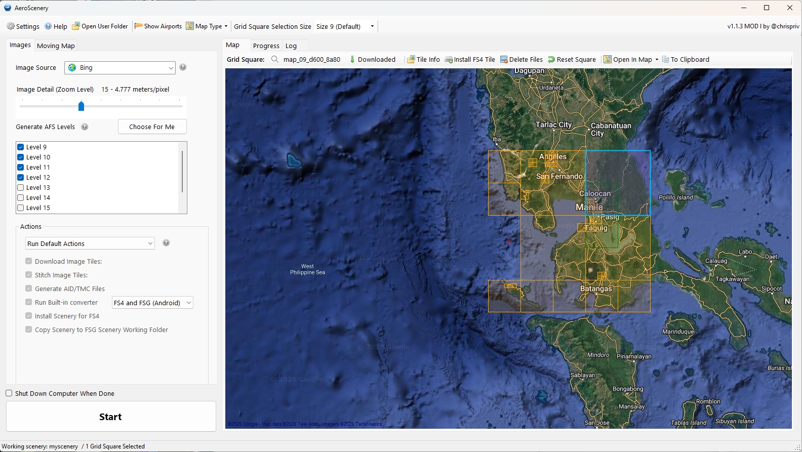
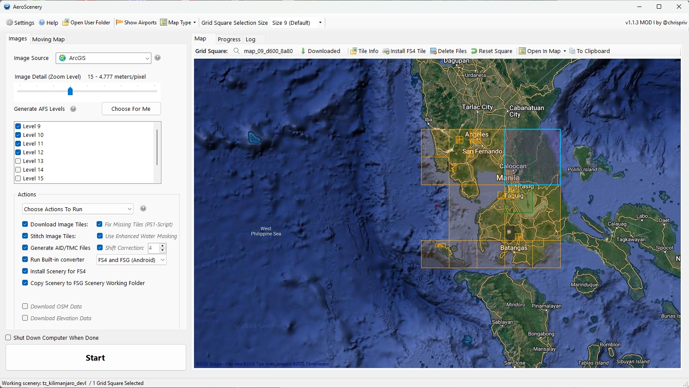

# Get Started – First Photo Scenery

Create a small test scenery for **Aerofly FS4** and optionally **FSG Android**
with **Community Mod l**.

Install first: [Installation Guide](installation.md) (portable ZIP by default).
Complete Settings tabs **AeroScenery** and **GeoConvert** before you continue.

The main window in **easy** mode (**Run Default Actions**) after a first start:

**Choose Actions To Run** lets you run or repeat **individual steps** (for
example stitch or convert again after editing images). Extra options such as
water masking, OSM, elevation or shift correction are activated in **Settings**.

The status bar shows **Working scenery: *name* / *n* Grid Square(s) Selected**.
**Tile Info** on the map toolbar opens stored details for the selected square.
**Right-click** a tile on the map opens that square’s working folder.

---

## Grid size and zoom (read this first)

Users often pick tiles that are too small, or Size 9 at much too high zoom **20**
(~0.149 m/pixel). That is far too heavy for a first try.

| Use | Grid Square Size (toolbar) | Image Detail (zoom) | Approx. resolution |
|---|---|---|---|
| First test | Size **11** | 15 or 16 | ~4.8 m or ~2.4 m |
| Normal base scenery | Size **9** or **10** (default 9) | 15 or 16 | ~4.8 m or ~2.4 m |
| Airports, towns (smaller area) | Smaller than the base, or a subset | 17 | ~1.2 m |
| Airport grounds, FS4 **PC** only | Small area | 18 | ~0.6 m |

Zoom **18** and a Generate AFS Levels level of 14 and higher is not useful for the **mobile** (FSG Android) path.

On the main window: set **Grid Square Selection Size** in the toolbar first,
then **Image Source**. The `(?)` next to Image Source explains the same order.

Do not start **multiples Size 9** squares on a first run. One test square is enough.

---

## Step 1 – Location and size

- Pan the map, pick area
- Toolbar: Size 11 for a test, later Size 9 or 10
- Click the map to select the square(s); one may be enough for a first try

---

## Step 2 – Image source and zoom

- Choose an image source (Google and similar sources have their own limits)
- Set **Image Detail (Zoom Level)** — 15 or 16 for the first scenery
- **Generate AFS Levels** → **Choose For Me** (see the `(?)` there) - keep the proposed levels

---

## Step 3 – Converter target and actions

Next to **Run Built-in converter**, choose:

- **Aerofly FS4** — DXT1 tiles for the PC
- **Aerofly FSG (Android)** — ETC2 tiles for mobile
- **FS4 and FSG (Android)** — both in one run

**Run Default Actions** runs the usual chain for that target (including
**Install Scenery for FS4** and/or **Copy Scenery to FSG Scenery Working
Folder**). Or **Choose Actions To Run** for single steps (for example run the
converter again after you edited stitched images). Keep **Run Default Actions** for a first try.

Set **AFS Working Scenery Folder** (and **FSG Scenery Working Folder** if you
use Android) in Settings first.

**Install FS4 Tile** on the map toolbar installs **only** the square that is
selected. Prefer these functions over copying files by hand.

On Start, confirm the destination path(s). **Cancel** stops the run. Progress
labels stay empty until work actually begins.

---

## Step 4 – Run and wait

Click **Start**. Downloads can take time. Conversion is heavier than the image
download.

The **built-in converter** always processes squares one after another. You can
keep using the map while it runs.

If you switched Settings to **Aerofly FS2 SDK GeoConvert**, that former process is
CPU and memory intensive and takes much longer. On a normal PC, turn on sequential GeoConvert in
Settings if you process more than one square. Details:
[Installation](installation.md) and [FAQ](faq.md).

---

## Step 5 – Check in Aerofly FS4

- Start Aerofly FS4 and check the scenery
- If nothing shows: you probably copied files manually — use **Install FS4
  Tile** or **Install Scenery for FS4** and check the AFS user folder path

---

## Step 6 – Optional: FSG Android (mobile)

If you have no Aerofly FS4 on this PC, you can still create FSG Android scenery.

1. Set **FSG Scenery Working Folder** in Settings.
2. Choose **Aerofly FSG (Android)** or **FS4 and FSG (Android)**.
3. Run Default Actions (or enable **Copy Scenery to FSG Scenery Working
   Folder** under Choose Actions To Run).
4. After conversion, AeroScenery copies ETC2 `.ttc` files into:

   `fsg_scenery_<name>\fsg_scenery_<name>_images\scenery\images\<level-9 map>\`

5. Zip the `_images` folder, rename `.zip` to `.tme`, and copy that file to
   FSG data path on the device. Zip & rename works **only for image scenery**. 

---

## Moving map (Aerofly FS4 only)

The moving map tracks the aircraft on the AeroScenery map. It works **only with
Aerofly FS4 on PC**:

- **FSG Android** has no *Broadcast flight info to IP address* setting.
- **Shared memory** works only on the **same PC** that is running FS4.

Open the **Moving Map** side tab. Use **UDP** or **DLL (Shared Memory)** under
the HUD. Map fixed, flight tracing and hide working tiles are optional.

### UDP

1. In Aerofly FS4: **Settings → Miscellaneous → Broadcast flight info to IP
   address = on**.
2. Set the broadcast IP to your subnet broadcast (last octet **255**), for
   example `192.168.1.255`.
3. Set **Broadcast IP port** to **49002**.
4. Click the moving-map `(?)` in AeroScenery to see the IPv4 address it
   detected. Allow AeroScenery through the firewall / antivirus if the map
   does not move.
5. Start a flight in FS4, then start the moving map in AeroScenery.

### Shared memory (DLL bridge)

This mode uses **AeroflyBridge** by [Juan Luis Gabriel (jlgabriel)](https://github.com/jlgabriel/Aerofly-FS4-Bridge)
(MIT). Follow that project’s **Quick install**:

1. Copy `AeroflyBridge.dll` into  
   `%USERPROFILE%\Documents\Aerofly FS 4\external_dll\`  
   Mod l includes a copy under `Resources\external_dll\`. You can also take
   the DLL from the [Aerofly-FS4-Bridge releases](https://github.com/jlgabriel/Aerofly-FS4-Bridge/releases).
2. Start Aerofly FS4 and load a flight.
3. In AeroScenery, select **DLL (Shared Memory)** on the Moving Map tab.

Credits: Aerofly FS4 Bridge — https://github.com/jlgabriel/Aerofly-FS4-Bridge

---

## Next

- Raise zoom only on airports and cities (17, or up to 18 on FS4 PC)
- Optional: OSM / elevation downloads, water masking (Settings + Actions)
- **Tile Info** after Generate AID/TMC; map squares with elevation-only data
  use a green border
- Moving map: UDP or shared-memory DLL (FS4 PC only)
- [Feature Overview](featureoverview.md)
- [FAQ](faq.md)
