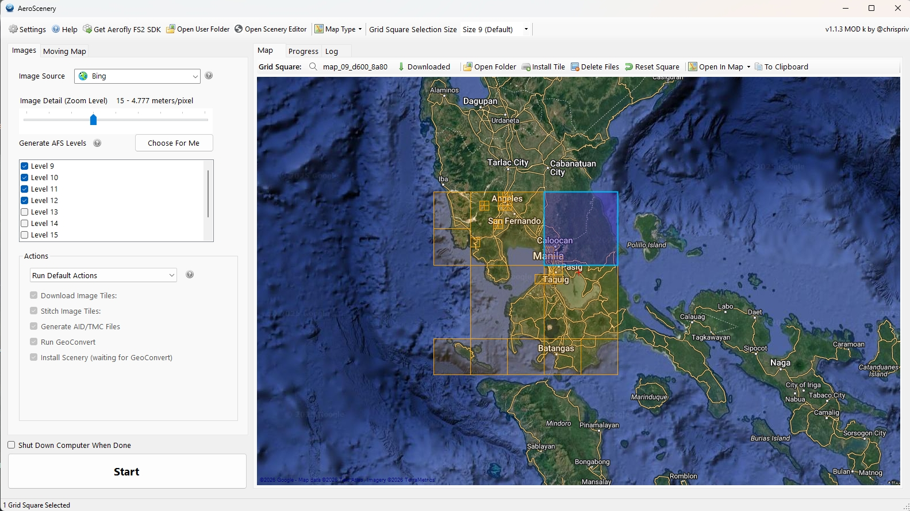

# AeroScenery Community Mod – Documentation

Guides for the **AeroScenery Community Mod k** fork of Nick Hod’s AeroScenery
1.1.3-beta. Mod k is **portable** (unzip and run). A later **2.0.0** line may
add a new community MSI; that is not part of Mod k.

---

## Getting Started

- 🚀 [Get Started](getstarted.md)  
  Install AeroScenery, first scenery, FSG Android conversion, moving map.

- 🛠️ [Installation Guide](installation.md)  
  Portable ZIP (default) or overlay on the official 1.0.1 MSI, GeoConvert path,
  first Settings tabs.

---

## Features and help

- ⭐ [Feature Overview](featureoverview.md)
- ❓ [FAQ](faq.md)
- 📝 [Changelog](https://github.com/chrispriv/aeroscenery-mod/blob/master/CHANGELOG.md)

---

## Project

Unofficial community fork of [AeroScenery](https://github.com/nickhod/aeroscenery).
The original author is inactive; this line keeps the app usable on current PCs
and Aerofly FS 4.

⬅️ [GitHub repository](https://github.com/chrispriv/aeroscenery-mod)
