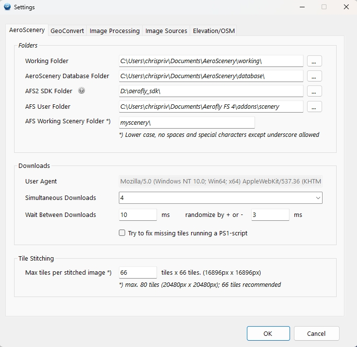
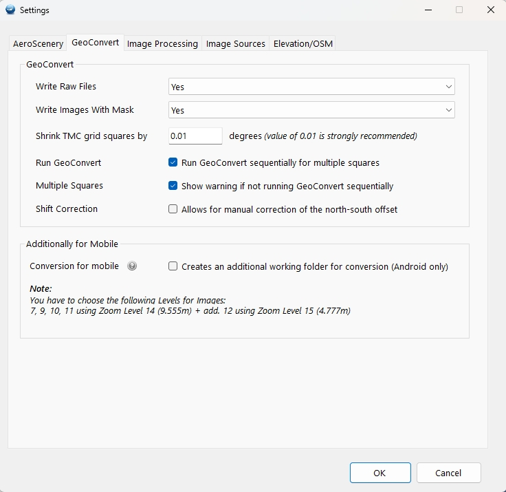

# Installation Guide

This guide covers **AeroScenery Community Mod k**.

**Default:** unzip, place the folder, start `AeroScenery.exe`. No installer.

**Alternative:** overlay the ZIP on Nick Hod’s official **AeroScenery 1.0.1 MSI**
(he did not publish an installer for 1.1.3).

GeoConvert from the Aerofly FS2 SDK is **not** inside the ZIP. You must unpack
it yourself and set the SDK folder under Settings.

---

## Method A — Portable (recommended)

1. Download the Mod k ZIP from [GitHub Releases](https://github.com/chrispriv/aeroscenery-mod/releases).
2. Extract the **entire** folder anywhere you can write (for example under
   Documents). Do not copy only `AeroScenery.exe`.
3. Start `AeroScenery.exe`.
4. Open **Settings** and complete the **AeroScenery** and **GeoConvert** tabs
   **before** you download tiles (see below).

No Program Files install is required. Do not mix this folder with an old
`GeoConvertWrapper.exe` tree. Sequential GeoConvert is built into Mod k.

---

## Method B — Overlay on AeroScenery 1.0.1 MSI

Use this if you already have (or prefer) the original installed app.

1. Install **AeroScenery 1.0.1** with Nick Hod’s official MSI:  
   https://github.com/nickhod/aeroscenery/releases/tag/1.0.1  
   There is no official MSI for 1.1.3.
2. Download the Community Mod k ZIP.
3. Extract it and copy **all** files into the install folder, typically  
   `C:\Program Files (x86)\AeroScenery\`
4. Overwrite when Windows asks (administrator rights are required).
5. Start AeroScenery and fill in the first two Settings tabs (see below).

Keep every DLL next to the EXE. A partial copy will fail at start.

---

## First launch — complete Settings (both first tabs)

Many problems come from skipping Settings. Example of typical first-run values
on the first two tabs:

Paths on your PC will differ. Fill in **AeroScenery** and **GeoConvert** as below.

### Tab 1 — AeroScenery

Set at least:

- **Working folder** — downloads, stitches, scripts (you may keep the default)
- **AeroScenery database folder** — user settings and SQLite database (you may keep the default)
- **Aerofly FS2 SDK path** (mandatory) — see the separate GeoConvert section
- **AFS user folder** — Aerofly FS4 user folder (Install Tile Scenery), users without fs4 may create a dummy folder
- **AFS Working Scenery Folder** — scenery name/folder used when installing
  into Aerofly FS4. Set this **before** using **Install Scenery (waiting for GeoConvert)**

### Tab 2 — GeoConvert

- Optional: **Run GeoConvert sequentially for multiple squares** (recommended
  on a normal PC)
- Optional: conversion-for-mobile folder (FSG Android only)

Do not start a job until these two tabs are filled.

---

## GeoConvert (Aerofly FS2 SDK)

AeroScenery calls `aerofly_fs_2_geoconvert.exe`. It is **not** bundled.

The SDK is no longer one installer package and supported by IPACS. It's even still available as **separate apps**. Download GeoConvert from:

https://www.aerofly-sim.de/aerofly_fs_2_sdk

Then:

1. **Unzip** the GeoConvert archive onto a disk (for example `D:\aerofly_sdk\`).
   Do not run a Windows “install” caus it contains no setup.
2. You need a subfolder that contains **`aerofly_fs_2_geoconvert\`** (with the
   EXE inside that subfolder).
3. In Settings → GeoConvert, set the path to the **SDK root**, not to the
   `.exe`.

Example:

- Correct: `D:\aerofly_sdk\`  
  (that folder contains `aerofly_fs_2_geoconvert\`)
- Wrong: `D:\aerofly_sdk\aerofly_fs_2_geoconvert\aerofly_fs_2_geoconvert.exe`

The `(?)` next to the SDK field describes the same rule.

---

## Installing scenery into Aerofly (do not copy by hand)

Once the GeoConverter process is complete, do **not** copy `.ttc` files into Aerofly folders manually.

- **Install Tile** (map toolbar) — current grid square only, after GeoConvert
- **Install Scenery (waiting for GeoConvert)** (Actions) — all selected squares,
  after GeoConvert has finished. Set **AFS Working Scenery Folder** on the
  AeroScenery Settings tab first. This is the straightforward path for
  Aerofly FS4 on PC.

---

## Several squares and GeoConvert load

Downloading many Size 9 tiles in sequence is usually fine.

**GeoConvert** on Mod j started several processes **in parallel**. On a typical
PC that saturates CPU and memory.

In Mod k:

- Settings → GeoConvert → **Run GeoConvert sequentially for multiple squares**
- If **Install Scenery (waiting for GeoConvert)** is on, processing stays
  sequential so install can wait for each job. AeroScenery then closes the
  GeoConvert window after about **60 seconds** of idle work unless you close
  it first. If detection fails, close the GeoConvert console manually.

A fast PC can still run GeoConvert in parallel (sequential option off) and
download or stitch further tiles while GeoConvert is busy. Start with
**one** test square.

---

## Check that it works

- AeroScenery starts
- SDK path is accepted (GeoConvert is found)
- One small square: download → stitch → GeoConvert → **Install Tile**

---

## Common issues

| Problem | Typical cause |
|---|---|
| GeoConvert not found | Path points at the EXE, or GeoConvert was “installed” and the folder layout is wrong |
| App starts then crashes on libraries | Incomplete ZIP copy; need all files beside the EXE |
| Access denied | Overlay under Program Files without admin rights — use Method A (portable) |
| Scenery missing in Aerofly | Files copied by hand; use Install Tile / Install Scenery and set the working scenery folder |
| PC freezes during GeoConvert | Many squares in parallel — enable sequential GeoConvert |
