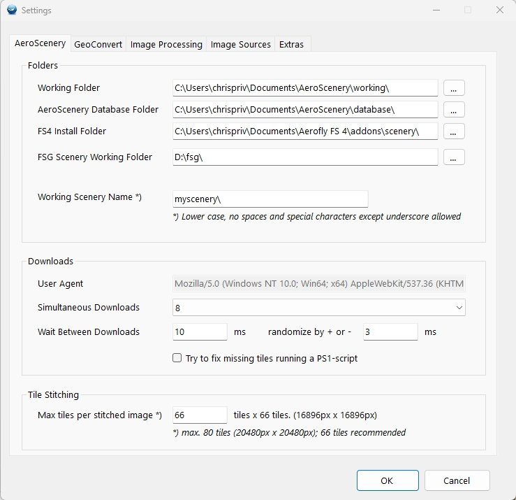
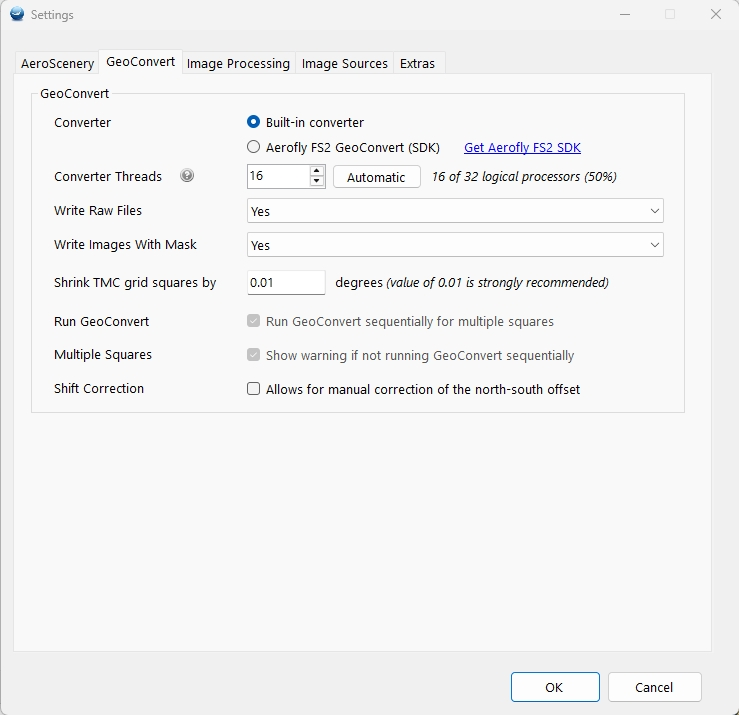

# Installation Guide

This guide covers **AeroScenery Community Mod l**.

**Default:** unzip, place the folder, start `AeroScenery.exe`. No installer.

**Alternative:** overlay the ZIP on Nick Hod’s official **AeroScenery 1.0.1 MSI**
(he did not publish an installer for 1.1.3).

The **built-in converter** is the default: it writes Aerofly FS4 and/or FSG
Android tiles in-process. The Aerofly FS2 SDK **GeoConvert** EXE is optional
and is **not** inside the ZIP. If you use it, unpack it yourself and set the
path under Settings.

Imagery from Google, Bing, ArcGIS and similar sources stays under those
providers’ terms even after conversion. Use it for your own, non-commercial
flying only.

---

## Method A — Portable (recommended)

1. Download the Mod l ZIP from [GitHub Releases](https://github.com/chrispriv/aeroscenery-mod/releases).
2. Extract the **entire** folder anywhere you can write (for example under
   Documents). Do not copy only `AeroScenery.exe`.
3. Start `AeroScenery.exe`.
4. Open **Settings** and complete the **AeroScenery** and **GeoConvert** tabs
   **before** you download tiles (see below).

No Program Files install is required. Do not mix this folder with an old
`GeoConvertWrapper.exe` tree.

---

## Method B — Overlay on AeroScenery 1.0.1 MSI

Use this if you already have (or prefer) the original installed app.

1. Install **AeroScenery 1.0.1** with Nick Hod’s official MSI:  
   https://github.com/nickhod/aeroscenery/releases/tag/1.0.1  
   There is no official MSI for 1.1.3.
2. Download the Community Mod l ZIP.
3. Extract it and copy **all** files into the install folder, typically  
   `C:\Program Files (x86)\AeroScenery\`
4. Overwrite when Windows asks (administrator rights are required).
5. Start AeroScenery and fill in the first two Settings tabs (see below).

Keep every DLL next to the EXE. A partial copy will fail at start.

---

## Verify the download (EXE hashes)

Mod l ships as a portable ZIP
(`AeroScenery_v1_1_3_MOD_l.zip` on
[release v1.1.3-mod.l](https://github.com/chrispriv/aeroscenery-mod/releases)).

| File | Algorithm | Hash |
|---|---|---|
| `AeroScenery.exe` | SHA-256 | `F37DDB26913294D38B7D15AED1553A7E3D5E681A7D672CFD31E40079CA06526A` |
| `AeroScenery.exe` | SHA-1 | `97A74DB37622749B8BB955B03E7AE3C46AF2DDA7` |
| `AeroScenery_v1_1_3_MOD_l.zip` | SHA-256 | `5F84D82C2DEF0A5BC116F509E32A27309391DDF135BDFFADA4E26C5666C59C94` |

On Windows PowerShell, hash the ZIP in the download folder first, then the EXE
after unzip:

```powershell
Get-FileHash .\AeroScenery_v1_1_3_MOD_l.zip -Algorithm SHA256
Get-FileHash .\AeroScenery_v1_1_3_MOD_l\AeroScenery\AeroScenery.exe -Algorithm SHA256
Get-FileHash .\AeroScenery_v1_1_3_MOD_l\AeroScenery\AeroScenery.exe -Algorithm SHA1
```

The hashes must match. Do not run the EXE if they differ.

---

## First launch — complete Settings (both first tabs)

Many problems come from skipping Settings. Example of typical first-run values
on the first two tabs:





Paths on your PC will differ. Fill in **AeroScenery** and **GeoConvert** as below.

### Tab 1 — AeroScenery

**Folders** (set these before Install / FSG copy):

- **Working Folder** — downloads, stitches and working files (you may keep the
  default)
- **AeroScenery Database Folder** — user settings and SQLite database (you may
  keep the default)
- **FS4 Install Folder** — Aerofly FS4 scenery install root (typically
  `Documents\Aerofly FS 4\addons\scenery`). Used by **Install Scenery for FS4**
  and **Install FS4 Tile**
- **Working Scenery Name** — name of the scenery folder created under the FS4
  Install Folder (lowercase, no spaces; underscore allowed). Set this before
  you install
- **FSG Scenery Working Folder** — separate folder for Android (ETC2) copy.
  Required when the convert target includes FSG; you later zip
  `fsg_scenery_<name>_images` to `.tme`

The same tab also has **Downloads** (simultaneous downloads, wait times) and
**Tile Stitching**. Defaults are fine for a first run.

### Tab 2 — GeoConvert

- **Built-in converter** (default) — converts TMC to TTC inside AeroScenery much faster (no SDK GeoConvert needed anymore). Choose the convert target on the main window:
  Aerofly FS4, Aerofly FSG (Android), or both.
- Optional: **Aerofly FS2 SDK GeoConvert** — set the path to
  **`aerofly_fs_2_geoconvert.exe`**. If you paste a folder, AeroScenery fills
  in the executable. Elevation mesh conversion uses the same file.
- Optional (SDK only): **Run GeoConvert sequentially for multiple squares**
  (recommended on a normal PC when using the SDK)

Do not start a job until the folder fields on the AeroScenery tab are filled
(and GeoConvert if you use the SDK).

### Tab Extras — OurAirports (optional)

**Show Airports** is on the last Settings tab, **Extras**. Download the
OurAirports CSV files, import `airports.csv` (and optionally `runways.csv`),
then the map toolbar button appears.

---

## GeoConvert (Aerofly FS2 SDK) — optional

You only need this if you select **Aerofly FS2 SDK GeoConvert** instead of the
built-in converter. AeroScenery then calls former `aerofly_fs_2_geoconvert.exe`. It is
**not** bundled.

The SDK is no longer one installer package. Download GeoConvert from:

https://www.aerofly-sim.de/aerofly_fs_2_sdk

Then:

1. **Unzip** the GeoConvert archive onto a disk (for example `D:\aerofly_sdk\`).
   It contains no Windows setup.
2. In Settings → GeoConvert, set the path to **`aerofly_fs_2_geoconvert.exe`**.
   A folder that contains that EXE (or the `aerofly_fs_2_geoconvert` folder) is
   also accepted and is stored as the EXE path.

Example:

- Correct: `D:\aerofly_sdk\aerofly_fs_2_geoconvert\aerofly_fs_2_geoconvert.exe`
- Also accepted: `D:\aerofly_sdk\` or `D:\aerofly_sdk\aerofly_fs_2_geoconvert\`
  (AeroScenery resolves the EXE)

The `(?)` next to the SDK field describes the same rule.

---

## Installing scenery into Aerofly (do not copy by hand)

Once conversion is complete, do **not** copy `.ttc` files into Aerofly folders
manually.

- **Install FS4 Tile** (map toolbar) — current grid square only, after conversion
- **Install Scenery for FS4** (Actions) — all selected squares, after conversion.
  Set **FS4 Install Folder** and **Working Scenery Name** on the AeroScenery
  tab first
- **Copy Scenery to FSG Scenery Working Folder** (Actions, when the convert
  target includes FSG) — copies ETC2 tiles into **FSG Scenery Working Folder**
  so you can zip them to `.tme`

On Start, if install and/or FSG copy is on, AeroScenery shows the destination
path(s) and waits for OK. **Cancel** aborts the run.

---

## Several squares and converter load

Downloading many Size 9 tiles in sequence is usually fine.

The **built-in converter** always processes selected squares **one after
another**.

**SDK GeoConvert** can start several processes in parallel. On a typical PC
that saturates CPU and memory.

- Settings → GeoConvert → **Run GeoConvert sequentially for multiple squares**
- If **Install Scenery for FS4** is on, sequential SDK jobs wait so install can
  run after each conversion. AeroScenery then closes the GeoConvert window after
  about **60 seconds** of idle work unless you close it first.

A fast PC can still run SDK GeoConvert in parallel (sequential option off) and
download or stitch further tiles while GeoConvert is busy. Start with
**one** test square.

---

## Check that it works

- AeroScenery starts (title bar: **1.1.3 MOD l**)
- One small square: download → stitch → Generate AID/TMC → **Run Built-in
  converter** (or SDK GeoConvert) → **Install FS4 Tile** and/or FSG copy
- Right-click a tile on the map opens its working folder; **Tile Info** on the
  map toolbar shows stored Generate AID/TMC details

---

## Common issues

| Problem | Typical cause |
|---|---|
| SDK GeoConvert not found | Path does not resolve to `aerofly_fs_2_geoconvert.exe` |
| App starts then crashes on libraries | Incomplete ZIP copy; need all files beside the EXE |
| Access denied | Overlay under Program Files without admin rights — use Method A (portable) |
| Scenery missing in Aerofly | Files copied by hand; use Install Tile / Install Scenery and check FS4 Install Folder plus Working Scenery Name |
| PC freezes during SDK GeoConvert | Many squares in parallel — enable sequential GeoConvert, or use the built-in converter |
| Start dialog Cancel still ran | Use the current Mod l build; Cancel now aborts before conversion |
